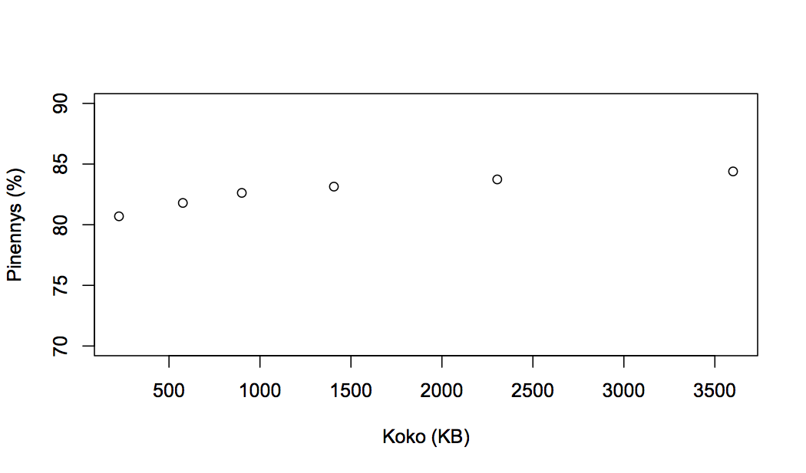
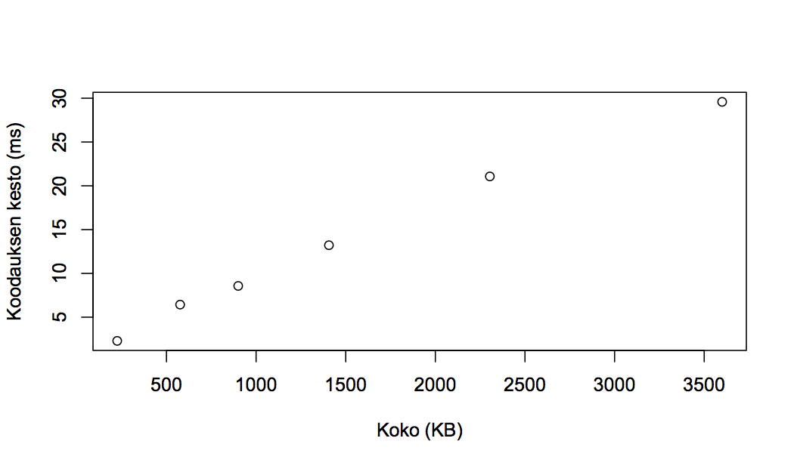
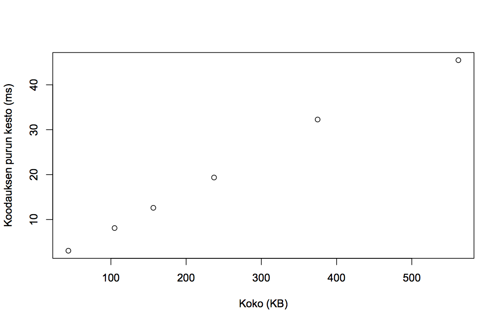
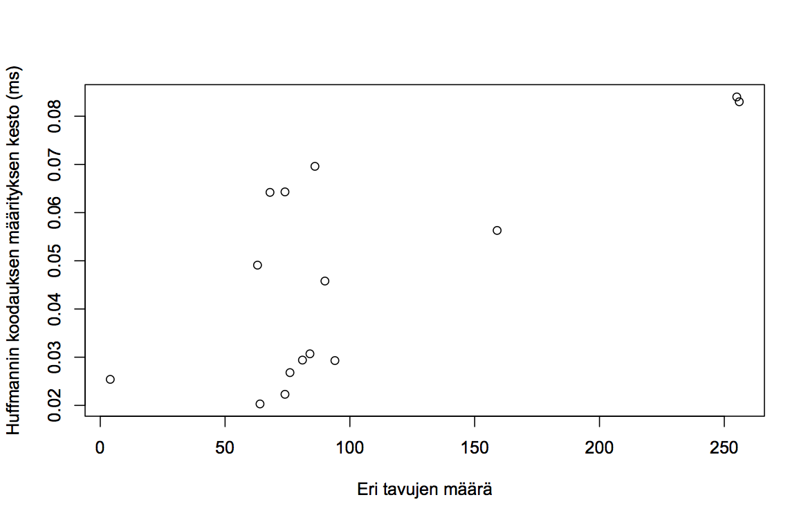

# Testaus

## Suorituskykytestaus
Suorituskykytestauksena erilaisia tiedostoja tiivistetiin
ja purettiin. Osa tiedostoista oli tiedon
tiivistämismenetelmien testaukseen usein käytetystä
Canterburyn korpuksesta. Loput olivat saman kuvan eri kokoja.
Saman kuvan käytön tarkoituksena oli saada mahdollisimman
keskenään vertailukelpoisia tuloksia kuuvajia varten.

### Kuvat
Testikappeleena toimi tämä kuva eri koissa.

Kuvien koot olivat
[320x240](https://upload.wikimedia.org/wikipedia/commons/thumb/a/a0/Huffman_coding_visualisation.svg/320px-Huffman_coding_visualisation.svg.png),
[512x384](https://upload.wikimedia.org/wikipedia/commons/thumb/a/a0/Huffman_coding_visualisation.svg/512px-Huffman_coding_visualisation.svg.png),
[800x600](https://upload.wikimedia.org/wikipedia/commons/thumb/a/a0/Huffman_coding_visualisation.svg/800px-Huffman_coding_visualisation.svg.png),
[1024x768](https://upload.wikimedia.org/wikipedia/commons/thumb/a/a0/Huffman_coding_visualisation.svg/1024px-Huffman_coding_visualisation.svg.png) ja
[1280x960](https://upload.wikimedia.org/wikipedia/commons/thumb/a/a0/Huffman_coding_visualisation.svg/1280px-Huffman_coding_visualisation.svg.png).
Ennen tiivistystä png-muotoiset kuvat muutettiin
bmp-muotoisiksi, jotta ne eivät olisi valmiiksi
tiivistettyjä. Tiivistys tapahtui ohjelman performance-test
toiminnolla. Ohjelman saamat tulokset lyötyvät kansiosta
dokumentaatio/suorituskykytestaus. Tiedostojen nimet ovat
kuvat-purku.csv ja kuvat-tiivistys.csv. Näistä tuloksista
tärkeimmät on esitetty kolmessa kuvaajassa.

Ensimmäisessä kuvaajassa näkyy, kuinka paljon kukin tiedosto
pieneni tiedoston alkuperäisen koon funktiona. Suuremmat
tiedostot näyttävät pinentyvän hieman enemmän kuin pienemmät,
mutta erot ovat hyvin pieniä.

Seuraavassa kuvaajassa näkyy tiedoston tavujen korvaamiseen
niitä vastaavalla Huffmannin koodilla kulunut aika tiedoston
koon funktiona. Odotetusti aika riippuu koosta lineaarisesti.

Viimeisessä kuvaajassa näkyy Huffmannin koodien korvaamiseen
niitä vastaavilla tavuilla kulunut aika tiivistetyn
tiedoston koon funktiona. Sekin riippuu
odotetusti tiedoston koosta lineaarisesti.

### Canterburyn korpus
Myös [Canterburyn korpuksen](http://corpus.canterbury.ac.nz/descriptions/)
tiedostoja tiivistettiin ja purettiin. Täydelliset tulokset löytyvät
tiedostoista canterbury-tiivistys ja canterbury-purku. Tiivistelmä
tuloksista on taulukossa.

| Tiedosto | Koko | Koko tiivistettynä | Pienennys | Eri tavuja | Huffmannin kesto | Koodauksen kesto | Koodauksen purun kesto |
|:---:|:---:|:---:|:---:|:---:|:---:|:---:|:---:|
| alice29.txt |152 KB|88 KB|42 %|74|0,06 ms|7,5 ms|6,5 ms|
| asyoulik.txt |125 KB|76 KB|39 %|68|0,06 ms|5,9 ms|5,3 ms|
| bible.txt |4 MB|2,2 MB|45 %|63|0,05 ms|182 ms|166 ms|
| cp.html |25 KB|16 KB|34 %|86|0,07 ms|1,4 ms|1,6 ms|
| E.coli |4,6 MB|1,3 MB|72 %|4|0,03 ms|146 ms|106 ms|
| fields.c |11 KB|7 KB|36 %|90|0,05 ms|0,63 ms|0,61 ms|
| grammar.lsp |4 KB|2 KB|39 %|76|0,03 ms|0,17 ms|0,17 ms|
| kennedy.xls |1 MB|463 KB|55 %|256|0,08 ms|32 ms|27 ms|
| lcet10.txt |427 KB|251 KB|41 %|84|0,03 ms|24 ms|21 ms|
| plrabn12.txt |482 KB|276 KB|43 %|81|0,03 ms|26 ms|22 ms|
| ptt5 |513 KB|107 KB|79 %|159|0,06 ms|9,2 ms|9,1 ms|
| random.txt |100 KB|75 KB|25 %|64|0,02 ms|8,0 ms|4,0 ms|
| sum |38 KB|26 KB|32 %|255|0,08 ms|2,0 ms|1,8 ms|
| world.txt 192 |2,5 MB|1,6 MB|37 %|94|0,03 ms|135 ms|113 ms|
| xargs.1 |4 KB|3 KB|36 %|74|0,02 ms|0,21 ms|0,17 ms|

Tiedostojen koot ovat pyöristettyjä. Pienennys on laskettu tarkoista
koista. Huffman viittaa Huffmannin koodauksen määrittämiseen, koodaus
tavujen vahtamiseen niitä vastaavilla koodeilla. Kaikki ajat ovat
mediaaneja 20 mittauksen tuloksista.

